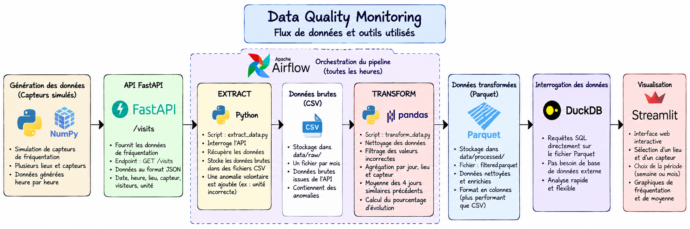

# Data Quality Monitoring

**Data Quality Monitoring** est un projet de **Data Engineering** permettant de simuler, collecter, contrôler, transformer et visualiser des données de fréquentation provenant de plusieurs capteurs.

L'objectif du projet est de construire un pipeline de données complet tout en mettant en pratique plusieurs problématiques de **qualité des données**.

## Liens du projet

🌐 **Application Streamlit :**  
https://data-quality-monitoring-issa.streamlit.app/

⚡ **API FastAPI / Swagger :**  
https://data-quality-monitoring-twre.onrender.com/docs

## Objectif du projet

Le projet simule des capteurs installés dans différents lieux afin de mesurer le nombre de visiteurs.

Le pipeline permet de :

- générer des données de fréquentation avec une API ;
- extraire automatiquement les données ;
- stocker les données brutes au format CSV ;
- simuler et détecter des problèmes de qualité de données ;
- nettoyer et transformer les données avec Pandas ;
- stocker les données transformées au format Parquet ;
- interroger les données avec DuckDB et SQL ;
- visualiser les résultats avec Streamlit ;
- orchestrer l'extraction et la transformation avec Apache Airflow.

## Architecture du pipeline



Le pipeline suit le flux suivant :

```text
Capteurs simulés
Python + NumPy
      │
      ▼
FastAPI
GET /visits
      │
      ▼
EXTRACT
Python
      │
      ▼
data/raw
CSV
      │
      ▼
TRANSFORM
Pandas
      │
      ▼
data/processed
Parquet
      │
      ▼
DuckDB + SQL
      │
      ▼
Streamlit
```

Apache Airflow orchestre les étapes d'extraction et de transformation :

```text
EXTRACT ──────► TRANSFORM
```

Le DAG est configuré pour exécuter le pipeline toutes les heures.

## Description du flux

Le projet **Data Quality Monitoring** met en place un pipeline complet permettant de simuler des données de fréquentation, de les collecter, de contrôler leur qualité, de les transformer puis de les visualiser dans une application web interactive.

### 1. Génération des données

La première étape du pipeline consiste à simuler des capteurs de fréquentation avec **Python** et **NumPy**.

Plusieurs capteurs sont associés à différents lieux et génèrent des données de fréquentation heure par heure.

### 2. API FastAPI

Les données générées par les capteurs sont exposées à travers une API développée avec **FastAPI**.

L'endpoint :

```text
GET /visits
```

permet de récupérer les données de fréquentation pour une date donnée.

Chaque observation contient notamment :

- la date ;
- l'heure ;
- l'identifiant du lieu ;
- l'identifiant du capteur ;
- le nombre de visiteurs ;
- l'unité de mesure.

L'API est déployée sur **Render** et peut être testée directement avec Swagger :

👉 **[Accéder à l'API FastAPI](https://data-quality-monitoring-twre.onrender.com/docs)**

### 3. Extraction des données

Le script :

```text
extract_data.py
```

interroge l'API afin de récupérer les données générées.

Les données brutes sont ensuite enregistrées au format **CSV** dans :

```text
data/raw/
```

Un fichier CSV est créé pour chaque mois.

Le projet introduit également volontairement certaines données incorrectes afin de simuler des problèmes de qualité de données, par exemple :

- un identifiant de capteur manquant ;
- une unité incorrecte.

Ces anomalies sont ensuite traitées pendant l'étape de transformation.

### 4. Transformation et qualité des données

Le script :

```text
transform_data.py
```

lit les fichiers CSV présents dans `data/raw` et utilise **Pandas** pour nettoyer et transformer les données.

Cette étape permet de :

- supprimer les valeurs manquantes ;
- filtrer les unités incorrectes ;
- agréger la fréquentation par jour, lieu et capteur ;
- calculer la moyenne des 4 jours similaires précédents ;
- calculer le pourcentage d'évolution par rapport à cette moyenne.

Les données nettoyées et enrichies sont ensuite enregistrées au format **Parquet** dans :

```text
data/processed/filtered.parquet
```

### 5. Interrogation avec DuckDB et SQL

**DuckDB** permet d'interroger directement le fichier Parquet avec des requêtes **SQL**.

Cette solution permet d'analyser les données sans avoir besoin de mettre en place une base de données externe.

Les données peuvent notamment être filtrées selon le lieu et le capteur sélectionnés dans l'application.

### 6. Visualisation avec Streamlit

Une application web développée avec **Streamlit** permet de visualiser les données transformées.

L'utilisateur peut sélectionner :

- un lieu ;
- un capteur associé à ce lieu ;
- une période : semaine ou mois.

L'application affiche les données correspondant à la sélection ainsi que des graphiques permettant de visualiser :

- les valeurs journalières ;
- la moyenne des 4 derniers jours similaires.

L'application est déployée sur **Streamlit Community Cloud** :

👉 **[Accéder à l'application Streamlit](https://data-quality-monitoring-issa.streamlit.app/)**

### 7. Orchestration avec Apache Airflow

**Apache Airflow** orchestre les étapes d'extraction et de transformation du pipeline.

Le DAG exécute les tâches dans l'ordre suivant :

```text
EXTRACT → TRANSFORM
```

Le pipeline est configuré pour être exécuté toutes les heures.

Dans ce projet, Airflow lance directement les scripts sur la machine locale afin de simplifier la démonstration.

Dans un environnement de production, Airflow servirait plutôt à orchestrer des traitements exécutés sur des serveurs ou des services dédiés. Les données pourraient par exemple être stockées dans un stockage objet comme **Amazon S3**.

## Technologies utilisées

- Python
- NumPy
- FastAPI
- Pandas
- PyArrow / Parquet
- DuckDB
- SQL
- Streamlit
- Plotly
- Apache Airflow
- Git
- GitHub
- Render
- Streamlit Community Cloud

## Parquet vs CSV

Dans ce projet, les données brutes sont d'abord stockées au format **CSV**, puis les données nettoyées et transformées sont stockées au format **Parquet**.

### CSV

Le format CSV est un format texte simple. Il est facile à lire et peut être utilisé par de nombreux outils.

Cependant, il ne conserve pas directement les types des colonnes et peut devenir volumineux lorsque la quantité de données augmente.

### Parquet

Parquet est un format de stockage en colonnes très utilisé dans le domaine de la data.

Contrairement au CSV, Parquet conserve le schéma et les types des données.

Il permet également la compression et permet de lire uniquement les colonnes nécessaires lors d'une analyse.

Dans ce projet :

```text
data/raw        → CSV
data/processed  → Parquet
```

## Structure principale du projet

```text
data-quality-monitoring/
│
├── dags/
│   └── data_quality_dag.py
│
├── data/
│   ├── raw/
│   └── processed/
│       └── filtered.parquet
│
├── images/
│   └── architecture.png
│
├── src/
│   ├── app.py
│   └── sensor.py
│
├── app.py
├── extract_data.py
├── transform_data.py
├── requirements.txt
└── README.md
```

## Pipeline complet

```text
Capteurs simulés
      │
      ▼
FastAPI
      │
      ▼
Extraction
      │
      ▼
CSV brut
      │
      ▼
Contrôle de la qualité
      │
      ▼
Transformation Pandas
      │
      ▼
Parquet
      │
      ▼
DuckDB + SQL
      │
      ▼
Streamlit
```

L'extraction et la transformation sont orchestrées avec **Apache Airflow**.

## Next Steps

Le projet actuel permet de démontrer le fonctionnement complet du pipeline. Avec davantage de temps, plusieurs améliorations pourraient être mises en place afin de rapprocher cette architecture d'un environnement de production.

### Stockage des données dans le Cloud

Les fichiers CSV et Parquet sont actuellement stockés localement dans les dossiers `data/raw` et `data/processed`.

Une évolution serait de stocker ces données dans un service de stockage Cloud comme **Amazon S3**.

Cela permettrait de centraliser les données et de les rendre accessibles aux différents services du pipeline.

### Exécution du pipeline dans le Cloud

Les traitements d'extraction et de transformation sont actuellement exécutés localement.

Une prochaine étape serait de déplacer leur exécution sur une infrastructure Cloud, par exemple une instance **Amazon EC2**, tout en utilisant Airflow pour orchestrer les différentes tâches.

### Récupération d'un an d'historique

Le pipeline pourrait récupérer et conserver au moins **un an d'historique** de fréquentation.

Un historique plus important permettrait d'effectuer des comparaisons sur de longues périodes et de mieux identifier les variations inhabituelles de fréquentation.

### Système d'alertes

Un système d'alertes pourrait être ajouté afin de détecter automatiquement les anomalies.

Par exemple, une alerte pourrait être déclenchée lorsqu'une valeur journalière pour un capteur passe sous un seuil défini.

Airflow pourrait ensuite déclencher automatiquement l'envoi d'un **email d'alerte** afin de prévenir l'équipe responsable du monitoring.

### Comparaison entre les capteurs d'un même lieu

Le projet pourrait également comparer le pourcentage d'évolution d'un capteur avec celui des autres capteurs du même lieu pour une même date.

Si le pourcentage de changement d'un capteur est très différent de celui des autres capteurs du lieu, une alerte pourrait être générée.

Cette approche permettrait notamment de détecter plus facilement un capteur défectueux ou une donnée anormale.

### Dashboards et graphiques supplémentaires

L'application Streamlit pourrait être enrichie avec de nouvelles visualisations, par exemple :

- évolution de la fréquentation sur plusieurs mois ;
- comparaison entre plusieurs capteurs ;
- comparaison entre plusieurs lieux ;
- nombre d'anomalies détectées ;
- évolution du pourcentage de changement ;
- tableau des alertes détectées.

### Monitoring du pipeline

Une évolution supplémentaire serait de mettre en place un suivi de l'état du pipeline afin de détecter les erreurs d'extraction ou de transformation.

Des notifications pourraient par exemple être envoyées automatiquement lorsqu'une tâche Airflow échoue.

### Tests et intégration continue

Le projet pourrait également être renforcé avec davantage de tests automatisés sur les différentes étapes du pipeline.

Une pipeline de **CI/CD avec GitHub Actions** pourrait automatiquement lancer les tests avant chaque déploiement et faciliter la mise en production des nouvelles versions.

## Déploiement

L'API FastAPI est déployée sur **Render** :

👉 **[Tester l'API](https://data-quality-monitoring-twre.onrender.com/docs)**

L'application de visualisation est déployée sur **Streamlit Community Cloud** :

👉 **[Ouvrir l'application Data Quality Monitoring](https://data-quality-monitoring-issa.streamlit.app/)**